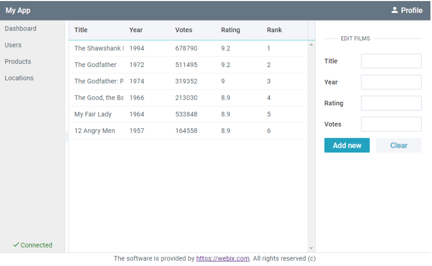
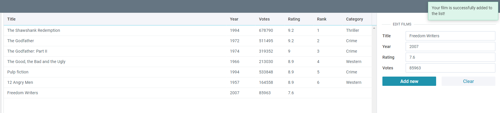
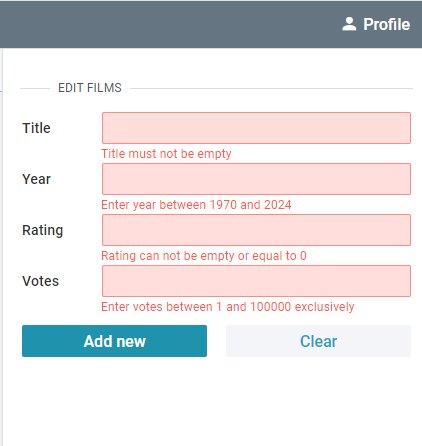
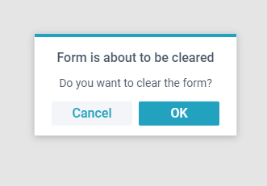

# How to run

- run ```npm install```
- run ```npm start```

# The task - My First App

This is Webix full screen app according to the following mockup: 

It was created:
1) Using Layout with 3 rows. 
2) Using Label and Button in the 1st row. 
3) Dividing the 2nd row into 3 columns for List, Datatable and Form. 
4) Using Template for the 3rd row with a clickable link.

User interaction was added via:
1) a popup on “Profile” button click [popup picture](images/popup.png)
2) a working form, allowing to add films to the datatable, check if form data is valid and clear form fields.


